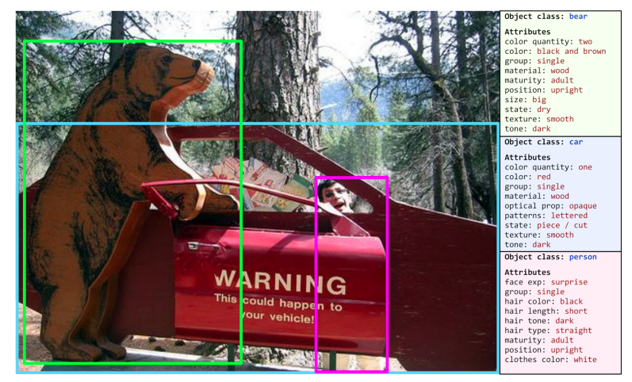
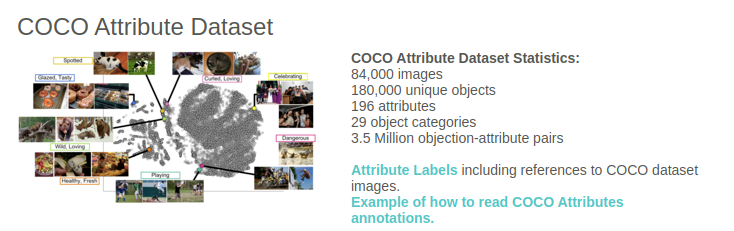
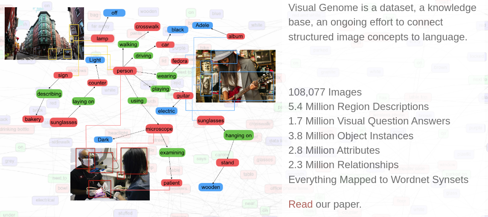

# Open-vocabulary Attribute Detection (2023 CVPR)
2023.08.07
___

## INTRO.

2023년도 Open-vocabulary Attribute Detection 분야의 논문이 2개 등장하였다.  

- Open-vocabulary Attribute Detection [CVPR 2023]
- OvarNet: Towards Open-vocabulary Object Attribute Recognition [CVPR 2023]

> **목표: 영상내에서 Open-set의 오브젝트를 검출하고, 오브젝트 단위로 Open-set의 속성을 인식하도록 모델을 학습시키는 것.**

이 글에서는 Open-vocabulary Attribute Detection의 필요성을 주장하면서 새로운 benchmark를 제시하는 Open-vocabulary Attribute Detection 논문을 리뷰한다.

## Attribute Detection의 필요성

- 물체의 사이즈, 색깔, 질감, 상태 등의 속성(Attribute)은 물체의 정체성에 중요한 역할을 한다.
- 조금이라도 물체에 대한 묘사를 변화시키면 물체의 외향, 관점에 대한 우리의 이해가 바뀔 수 있다.

다음은 논문에서 예를 들며 제시한 시나리오 이다.

예를 들어 운전 중에 위의 그림과 같이 곰을 맞딱들였을때, 우리는 곰의 종류는 구분하거나 알지 못하더라도 그것이 나무로 만들어진 가짜이고, 위험하지 않다는 것을 알 수 있다.

이처럼, 모델이 물체의 속성을 검출할 수 있다면 물체와 속성을 결함함으로써 더 풍부한 추론이 가능해진다.

## Open-vocabulary Attribute Detection task

줄여서 OVAD는 두 단계로 이루어진다.  
1.  Open-vocabulary Object Detection - image 내에서 `novel` objects를 포함한 모든 object를 찾아낸다.  
> `novel` object는 학습동안 bounding box와 class annotation이 주어지지 않는 셋을 뜻한다.

2. 각각의 검출된 object에 존재하는 모든 attribute를 결정.  
> attribute annotation은 존재하지 않고, 따라서 모든 attribute는 `novel`셋이다.

___
## Related Works

관련 연구에 대한 키워드로는 Attribute prediction, Attribute detection benchmarks, Open vocabulary methods, Vision-language models가 있다.

### Attribute prediction
Attribute prediction이라는 용어는 초기에는 단계적으로 물체의 부분(part)를 묘사하는데 초점을 맞췄다. 하지만 이 task는 Part Detection이라 할 수 있다.  

- [Describing Objects by their Attributes (CVPR2009)](https://www.cs.cmu.edu/~afarhadi/papers/Attributes.pdf)  
- [Learning Visual Attributes (NeurlIPS 2007)](https://papers.nips.cc/paper_files/paper/2007/file/ed265bc903a5a097f61d3ec064d96d2e-Paper.pdf)

이 논문에서는 **형용사로 표현되는 시각적 속성들(visual attributes)** 에 초점을 둔다.

fine-grained semantics를 학습시키는 다른 benchmark들은 shoes, clothes, birds, animals와 같은 좁은 class 도메인에 초점을 맞춘다.

- [Discovering States and Transformations in Image Collections (CVPR 2015)](http://web.mit.edu/phillipi/Public/states_and_transformations/index.html)
- [Fine-Grained Visual Comparision with Local Learning (CVPR 2014)](https://www.cs.utexas.edu/~grauman/papers/yu-cvpr2014.pdf) [shoes]
- [Automatic Attribute Discovery and Characterization from Noisy Web Data (ECCV 2010)](https://link.springer.com/chapter/10.1007/978-3-642-15549-9_48) [clothes]
- [Automatic Spatially-aware Fashion Concept Discovery (ICCV 2017)](https://arxiv.org/abs/1708.01311) [clothes]
- [Caltech-UCSD Birds 200 (Technical report 2010)](https://authors.library.caltech.edu/27468/1/WelinderEtal10_CUB-200.pdf) [birds]
- [Zero-shot learning-the good, the bad and th ugly (CVPR 2017)](https://arxiv.org/abs/1703.04394) [animals]

또 다른 연구들은 attribute를 중간 단계에서 추론하여 zero-shot object detection을 진행하거나, object-attribute compositionality 에 의존하여 zero-shot attribute-object classification을 수행한다.

- [Recovering the Missing Link: Predicting Class-Attribute Associations for Unsupervised Zero-Shot Learning (CVPR 2016)](https://www.cv-foundation.org/openaccess/content_cvpr_2016/html/Al-Halah_Recovering_the_Missing_CVPR_2016_paper.html)
- [Locality and compositionality in zero-shot learning (ICLR 2020)](https://arxiv.org/abs/1912.12179)
- [Attribute Prototype Network for Zero-Shot Learning (NeurIPS 2020)](https://arxiv.org/abs/2008.08290)

- [Learning to infer unseen attribute-object compositionsar (arXiv 2020)](https://arxiv.org/abs/2010.14343)

- [Symmetry and Group in Attribute-Object Compositions (CVPR2020)](https://openaccess.thecvf.com/content_CVPR_2020/papers/Li_Symmetry_and_Group_in_Attribute-Object_Compositions_CVPR_2020_paper.pdf)

**이 논문에서의 연구는 vision-language 모델의 object detection과 object-level의 attribute를 zero-shot 방식으로 구별하는 능력을 평가한다.**

### Attribute detection benchmarks
open-domain setting (=in-the-wild setting)에서 attribute를 예측하는 최근의 연구들이 있고, bench mark의 수는 적다.  
- COCO Attributes

    

    - COCO dataset에 visual attribute를 주기한 첫번째 large-scale benchmark이다.
    - 적은 범위로 한정된다. 29개의 카테고리에만 주기되어있다.

- Visual Genome

    

    - 더 넓은 범위의 attribute categories를 포함한다. 
    - 하지만 각 object에 대해 적은 수의 attribute annotation만 포함한다. (0.74 attributes per instance)
    - Visual Genome 은 추출된 방식에 의해 모든 객체에 대해 조밀하거나 완전하지 않다.
    - sparsity, nosie, lack of negative annotations 와 같은 특성으로 인해 OVAD task 평가에 부적합하다.

- 다른 연구들은 VQA(visual question answering) datasets을 사용하는것을 제안하였다.
    - VQA는 색 또는 재질을 묻는 OVAD와 목적이 겹치지만 attribute와 명사에 대한 성능은 VQA 데이터셋을 사용하여 분리 및 분석할 수 없다.

- VAW 

    - VAW는 넓은 범위의 attribute와 object category를 제공한다.
    - 신뢰할 만한 positive, negative attribute label 과 object-attribute 쌍을 충분히 제공한다.
    - 그러나 annotation cost를 위해 automated filtering techniques가 적용되는데, 그 결과 이미지당 인스턴스 수 및 인스턴스당 attribute 측면에서 주석이 매우 희박하다.

- OpenImages
    
    - object category 수를 포함하여 이미지 데이터가 많지만, attribute category가 15개로 제한적이다.

> 이 논문에서는 명확하고 밀도있는 attribute annotation 과 함께 attribute detection을 위한 새로운 evaluation benchmark를 제안한다.

### Open-vocabulary Methods
### Vision-language Models

___
## Open-vocabulary Attribute Detection

 

### OVAD Task란

 

OVAD Task는 두가지 목표를 갖는다.  

    (1) object detection  
    (2) discovery of attributes for all detected objects    

둘다 Open-vocabulary setting에서 진행된다.

(1)은 Open-vocabulary Object detection (OVD)로 알려져있다. (생략)

(2)에서는 학습중에 어떤 attribute도 알려지지 않는다. 모든 attribute들은 반드시 image-caption 쌍 또는 사전학습된 vision-language 모델로 부터 유도 되어야한다.

오직 test time에만 시험되는 visual attributes A가 주어진다.

> 모델을 설계할 때에 attribute classes의 tested set의 정보를 사용하는 것은 이 task의 정의에 위배된다.

 

> OVAD task를 해결하기 위해서는 $O^B$ 와 unbounded $O^N$ 를 모두 detect 하는 능력 뿐만아니라 tested attribute set $A$로 부터 어떤 attribute가 존재하고 부재되었는지를 모든 object에 대해서 결정할 수 있는 능력이 요구된다.

___
## Baseline Method

- 두가지의 모델을 사용

     

    - a frozen language model $G$
        - CLIP 모델을 사용함.
        - text embedding : $g_w = G(w)$  
        (text는 하나 또는 더 많은 단어들 $w$ 로 구성됨.)

         

    - object detector $F$ based on Faster-RCNN
        - classification head를 linear layer로 바꾸어 $G$ 로부터 생성된 language space에 visual feature를 projection할 수 있도록 함.
        - visual embedding : $f_b = F(I_b)$  
        (image $I$ 의 box region $b$)
    
- Visual-text matching

    - vision language alignment를 위해 image-text pairs를 사용. 
    - image-text pairs는 서로 대응되는 images와 captions, box-regions와 class labels 또는  
        더 일반적인 setting, 모든 box-region과 text
    - text $w$ 와 box-region $b$ 의 matching score 계산을 위해 cosine similarity 를 사용.

    $$s_{w, b} = \sigma({{g_w {\cdot} f_b} \over {|g_w||f_b|}}{\cdot} {\tau})$$

- Training objectives

    - detector $F$는 세가지 objectives로 학습됨.

            1. image내의 object를 localization하는 것을 학습
            2. image representation과 caption embedding을 의미적으로 매칭하는 것을 학습.
            3. noel class와 attribute에 대한 예측이 가능하도록 하기 위해 proxy-labels와 함께 
               classifier branch를 학습.

     

    1. image내의 object를 localization하는 것을 학습
    
        
        - detecot $F$ 학습을 위해, $O^B$ 의 label과 bounding box를 사용.
        - 기본적인 detection loss $L_{det}$ 를 사용. (faster R-CNN)
        
        $$L_{det} = L_{rpn} + L_{reg} + L_{cls}$$

        > $L_{rpn}$ : region proposal network loss  

        > $L_{reg}$ : class-agnostic $l_1$ loss  

        > $L_{cls}$ : similarity based classification loss  
          binary cross-entropy loss over the similarity score between the visual embedding of the object box and the text embedding of the base classes.)
        
    2. image representation과 caption embedding을 의미적으로 매칭하는 것을 학습.

        $$L_{ITC} = -(ylog(s_{C,I}) + (1-y)log(1-s_{C,I}))$$

        > $s_{C,I}$ : image $I$ 와 caption $C$ 의 similarity score  
        > $y {\in} \{1, 0\}$ : $I$ 와 $C$ 가 positive pair인지 아닌지.

    3. novel class와 attribute에 대한 예측이 가능하도록 하기 위해 proxy-labels와 함께 classifier branch를 학습.

        caption 내의 concept들을 image region과 매칭. -> 이 concpet들을 **"Part of caption"** 으로 부르기로함.(명사, 명사구, 명사 보어를 포함)

        **이 caption의 부분 (명사, 명사구, 명사 보어) 들이 objects와 attribute를 위한 proxy-labels로 사용된다.**

        > 오픈 소스 spaCy의 part-of-speech tagging method를 사용하여 얻어낸다.
        
        - 명사들은 보통 object class를 나타낸다.  
            종종 attribute 정보를 나타낸다. (man/woman - gender, 복수형 - quantity)
        - 명사구는 보통 형용사-명사의 결합이다.
            명시적인 attribute 정보를 포함한다. (red helmet, wooden table)
        - 명사 보어를 얻기 위해 명사구에서 명사를 제거한다.
            보통 형용사를 포함하고 이것들을 image region과 직접적으로 매칭한다.
            > 이 concept들(part of caption)의 위치는 알려지지 않기 때문에 우리는 proxy-label을 가장큰 bounding box features $F(I_{b_{max}})$ 와 매칭 시킨다. 
            
            [Detecting Twenty-thousand Classes using Image-level Supervision (ECCV2020)](https://arxiv.org/pdf/2201.02605.pdf)

### Inference

- inference time에는 모든 object classes, $O^B {\cup} O^N$ 로 구성된 vocabulary 를 고려한다.이때 attribute classes $A$ 도 포함한다.  
- language model $G$ 를 사용하여 모든 class에 대응되는 text-vector representation을 얻는다. 이때 어떤 text prompt도 사용하지 않고 **모든 object/attribute 동의어를 고려하면서 그것들의 text-vector representation을 평균내어 사용한다.**
- 최종적으로 box-region representation $F(I_b)$ 와 class-text embedding $G(c)$ 의 similarity 에 sigmoid를 취함으로써 object와 attribute class의 prediction을 얻는다.
- 각 object와 attribute class에 대해 output을 분리하여 계산하여 class의 존재와 부재를 예측

